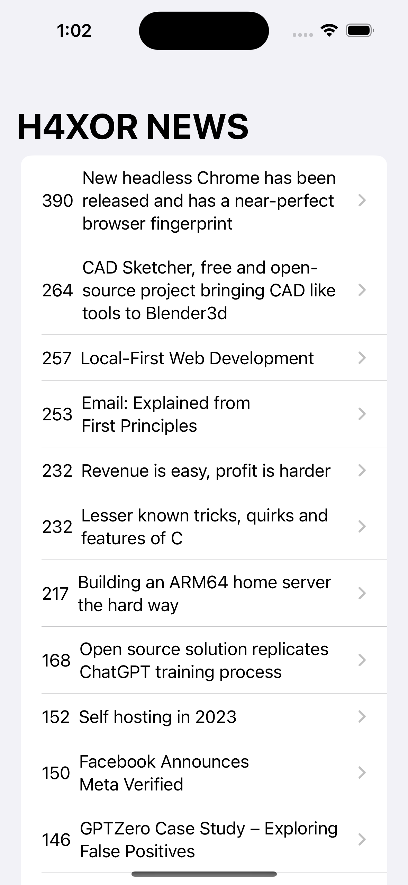
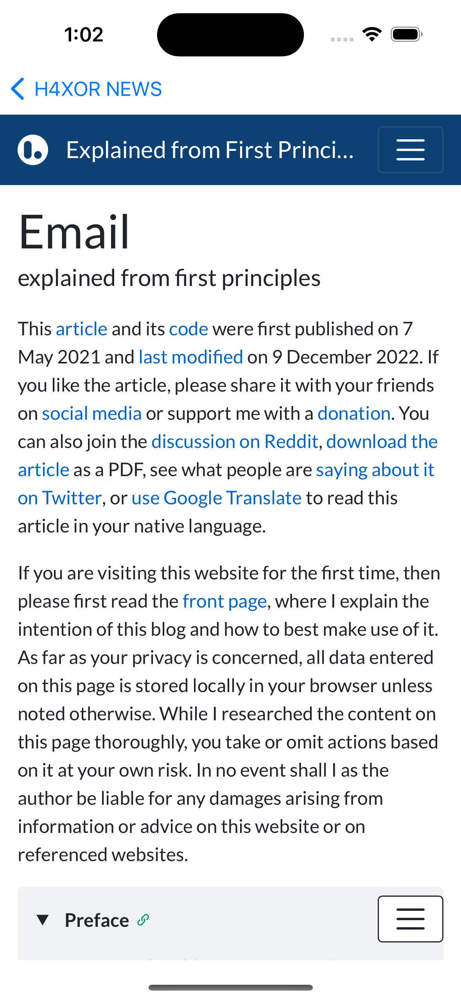
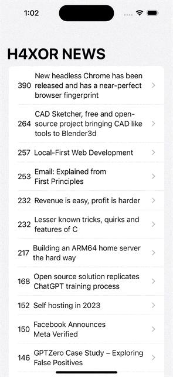

# To-Do-App
App that shows the lates news about technologies. The app creates a querry to the site's API and then uses it to populate the cells
Technologies used: 
Json, SwiftUI
-----------------------------------------------------

 
 
 

